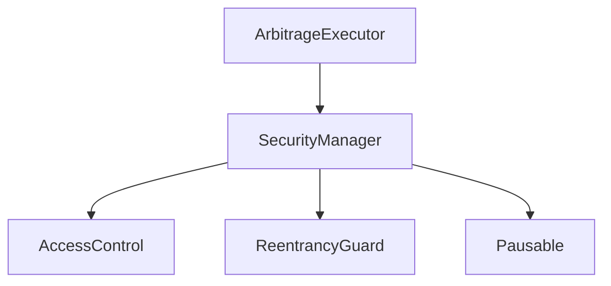
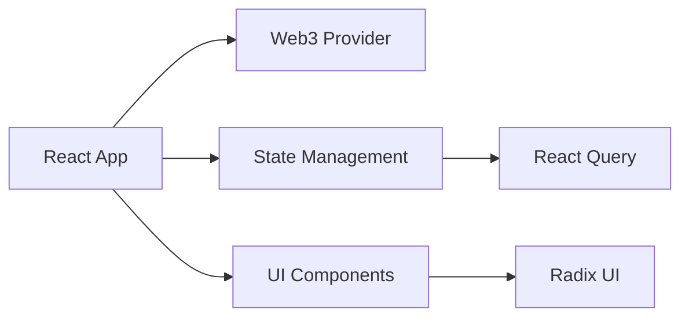
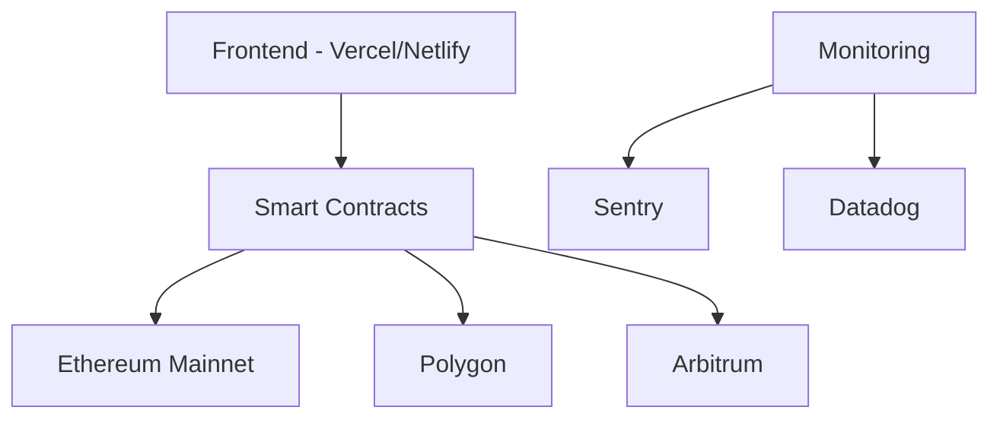

# Flash Trade Logic Architecture

## System Overview

The Flash Trade Logic system is a secure, high-performance arbitrage trading platform built on blockchain technology. The system consists of several key components working together to execute profitable trades while maintaining security and monitoring.

## Core Components

### 1. Smart Contracts

- **ArbitrageExecutor**: Main contract for executing flash trades
- **SecurityManager**: Handles security, rate limiting, and emergency controls
- **AccessControl**: Role-based permission management
- **ReentrancyGuard**: Prevents reentrancy attacks
- **Pausable**: Emergency shutdown capability

### 2. Frontend Architecture

### 3. Security Infrastructure

- Rate limiting per address
- Gas price limits
- Emergency shutdown mechanism
- Role-based access control
- Monitoring and alerting

### 4. Monitoring Stack

- Sentry for error tracking
- Datadog for performance monitoring
- Transaction monitoring
- Custom metrics tracking

## Data Flow

1. User initiates trade through frontend
2. Security checks (rate limits, gas price)
3. Smart contract execution
4. Transaction monitoring
5. Result verification and profit calculation

## Security Measures

1. **Smart Contract Security**
   - Rate limiting
   - Access control
   - Emergency shutdown
   - Gas price limits

2. **Infrastructure Security**
   - Environment variable management
   - API key security
   - Monitoring and alerting

3. **Development Security**
   - Pre-commit hooks
   - Code review process
   - Automated testing
   - Security audits

## Deployment Architecture

## Testing Strategy

1. **Unit Tests**
   - Smart contract function testing
   - Frontend component testing
   - Utility function testing

2. **Integration Tests**
   - End-to-end trade flow
   - Security mechanism testing
   - Cross-contract interaction

3. **Performance Testing**
   - Gas optimization
   - Rate limit verification
   - Stress testing

## Upgrade Strategy

The system uses the OpenZeppelin Upgrades plugin for smart contract upgradeability:

1. Proxy pattern for contract upgrades
2. Storage layout preservation
3. Proper initialization
4. Access control for upgrades
