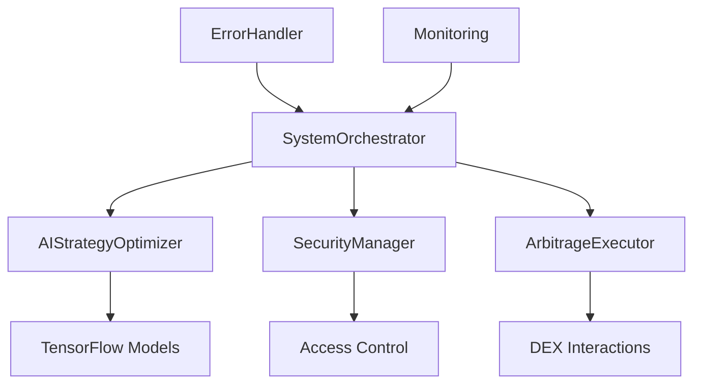
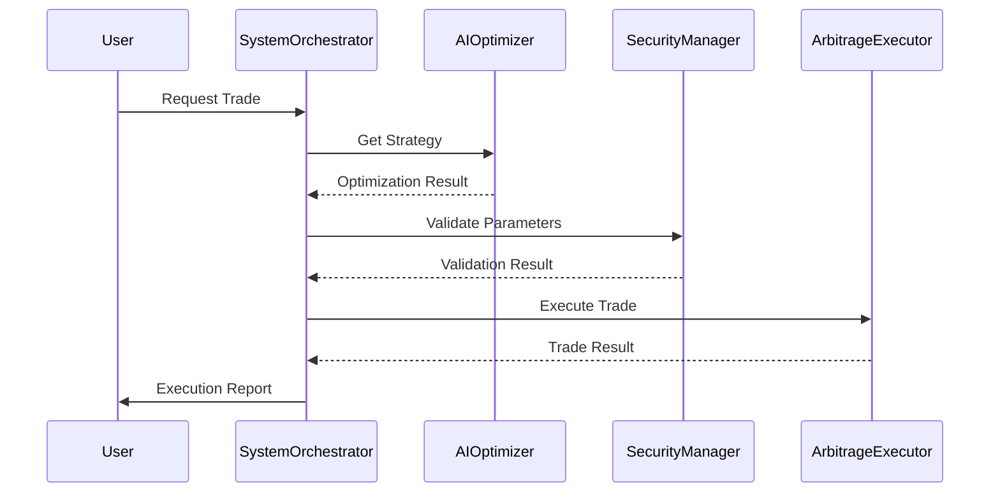
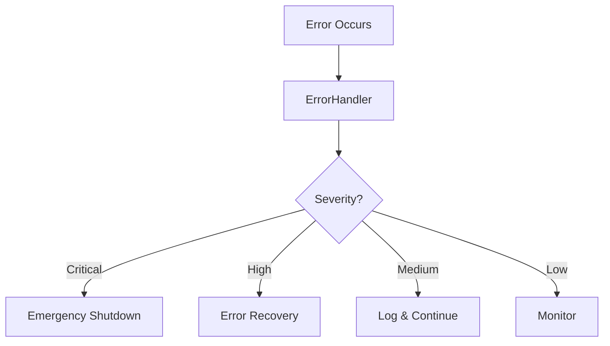

# Flash Trade Logic Technical Documentation

## System Architecture

### Core Components Integration



## Component Documentation

### 1. System Orchestrator

The `SystemOrchestrator` serves as the central coordination point, integrating:
- AI Strategy Optimization
- Security Management
- Trade Execution
- Error Handling
- Performance Monitoring

```typescript
interface ISystemOrchestrator {
  initialize(): Promise<void>;
  optimizeAndExecuteStrategy(
    marketConditions: MarketConditions,
    networkState: NetworkState
  ): Promise<void>;
}
```

### 2. AI Strategy Optimizer

Implements machine learning models for:
- Trade timing optimization
- Size recommendations
- Slippage prediction
- Gas optimization

Key Features:
- TensorFlow.js integration
- Real-time model updates
- Performance analytics
- Risk scoring

### 3. Security Infrastructure

#### SecurityManager Contract
```solidity
interface ISecurityManager {
    function checkTradeLimit(address trader) external;
    function emergencyShutdown() external;
    function resume() external;
    function setMaxGasPrice(uint256 price) external;
    function setRateLimit(uint256 limit) external;
}
```

#### Access Control
- Role-based permissions
- Multi-signature support
- Emergency controls
- Rate limiting

### 4. Error Handling

Comprehensive error management through `ErrorHandler`:
- Error categorization
- Severity levels
- Context preservation
- Recovery mechanisms

## API Reference

### 1. Trade Execution API

```typescript
interface ITradeExecution {
  executeTrade(
    amount: BigNumber,
    gasPrice: BigNumber,
    options?: TradeOptions
  ): Promise<ContractTransaction>;
}
```

### 2. Strategy Optimization API

```typescript
interface IStrategyOptimization {
  predictOptimalParameters(
    marketConditions: MarketConditions,
    networkState: NetworkState
  ): Promise<OptimizationResult>;
}
```

### 3. Security Management API

```typescript
interface ISecurityManagement {
  validateSecurityParameters(
    optimization: OptimizationResult
  ): Promise<void>;
  
  checkRateLimits(
    trader: string
  ): Promise<void>;
}
```

## Data Flow

### 1. Trade Execution Flow



### 2. Error Propagation



## Performance Optimization

### 1. Gas Optimization

- Dynamic gas price adjustment
- Batch transaction processing
- Contract optimization techniques
- Gas usage monitoring

### 2. Memory Management

- Efficient data structures
- Proper cleanup procedures
- Memory usage monitoring
- Cache optimization

### 3. Network Optimization

- Multi-network support
- Fallback providers
- Connection pooling
- Request batching

## Testing Infrastructure

### 1. Unit Tests

```typescript
describe('SystemOrchestrator', () => {
  it('should initialize correctly', async () => {
    // Test implementation
  });
  
  it('should handle errors properly', async () => {
    // Test implementation
  });
});
```

### 2. Integration Tests

- End-to-end trade flow
- Security mechanism testing
- Performance testing
- Error handling validation

### 3. Contract Tests

- Deployment verification
- Upgrade testing
- Security validation
- Gas optimization tests

## Monitoring and Metrics

### 1. System Metrics

- Trade success rate
- Gas efficiency
- Response times
- Error rates

### 2. Performance Metrics

- Profit/loss tracking
- Slippage analysis
- Execution time
- Network latency

### 3. Security Metrics

- Rate limit violations
- Access attempts
- Emergency triggers
- Network anomalies

## Deployment

### 1. Contract Deployment

```javascript
async function deployContracts() {
  // Implementation details
}
```

### 2. Frontend Deployment

- Build optimization
- Asset management
- Cache strategies
- CDN integration

### 3. Monitoring Setup

- Sentry configuration
- Datadog integration
- Log management
- Alert configuration

## Maintenance

### 1. Upgrades

- Smart contract upgrades
- Frontend updates
- Dependencies management
- Database migrations

### 2. Backup Procedures

- Configuration backup
- Database backup
- Contract state backup
- Recovery procedures

### 3. Emergency Procedures

- System shutdown
- State recovery
- User notification
- Incident response
